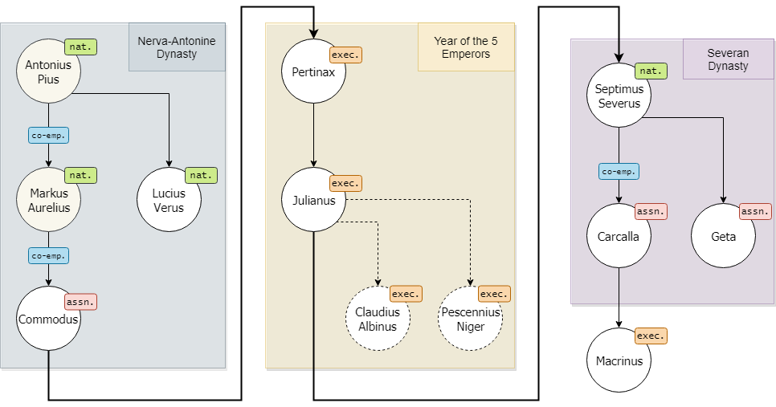
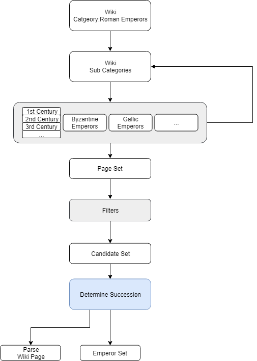

# Succession

## Summary

**Succession:** a tool to trace the succession of leaders in a graph form,
read the history/biography as you click and work down the years.
Nice for studying political history.

## Features

- Trace all political lineages
- Include significant contenders, usurpers, and challengers.
- Tag particular nodes (leaders) with attributes that can be searched and filtered
- Support complex range filters and selection filters e.g. All emperors assassinated within 5 years of their rule.

## Example Output



## Queries


## Wiki Notes

### Infobox

https://en.wikipedia.org/wiki/Template:Infobox_royalty

### Other Infoboxes

https://en.wikipedia.org/wiki/Template:Infobox_peerage_title
https://en.wikipedia.org/wiki/Template:Infobox_baronetage
https://en.wikipedia.org/wiki/Template:Infobox_Egyptian_dignitary
https://en.wikipedia.org/wiki/Template:Infobox_noble
https://en.wikipedia.org/wiki/Template:Infobox_peer
https://en.wikipedia.org/wiki/Template:Infobox_pharaoh
https://en.wikipedia.org/wiki/Template:Infobox_pretender

### Micro formats

"The HTML markup produced by this template includes an hCard microformat, which makes the person's details parsable by computers"

https://en.wikipedia.org/wiki/HCard

https://en.wikipedia.org/wiki/Wikipedia:WikiProject_Microformats

Unfortunately the hCards are not complete.
Take Trajan for example:

```

```

## Architecture


