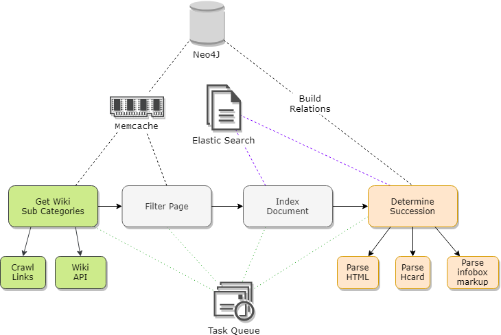

# Succession

**WORK IN PROGRESS**

## The Plan

**Succession:** a tool to trace the succession of leaders in graph form,
read the history/biography as you click and work down the years.
Nice for studying political history.

## Features

- Trace all political lineages (!)
- Include significant contenders, usurpers, and challengers.
- Tag particular nodes (leaders) with attributes that can be searched and filtered
- Support complex range filters and selection filters, such as:
  + Dynasties with more than 3 generations
  + All emperors assassinated within 5 years of their rule
  + Dynasties with interrupted succession

## Architecture

<p align="center">
  
</p>

## Wiki Notes

### Micro formats

#### Info

"The HTML markup produced by this template includes an hCard microformat, which makes the person's details parsable by computers"

- hCard 1.0 Spec: http://microformats.org/wiki/hcard
- Property List: http://microformats.org/wiki/hcard#Property_List
- https://en.wikipedia.org/wiki/HCard
- https://en.wikipedia.org/wiki/Wikipedia:WikiProject_Microformats
- https://en.wikipedia.org/wiki/Wikipedia:WikiProject_Microformats/hcard
- Address only subset of hCard: https://en.wikipedia.org/wiki/Adr_(microformat)

### Format

```HTML
<div class="vcard">
    <span class="fname"></span>
    <span class="role"></span>
    <span class="bday"></span>
    ...
</div>
```

Successor and predecssor info is not part of the spec, it must be parsed from wikipedia's infobox.

Example from Trajan's hCard/infobox HTML:

```HTML
<table>
  <tbody>
    ...

    <tr>
      <th scope="row">Predecessor</th>
      <td><a href="/wiki/Nerva" title="Nerva">Nerva</a></td>
    </tr>
    <tr>
      <th scope="row">Successor</th>
      <td><a href="/wiki/Hadrian" title="Hadrian">Hadrian</a></td>
    </tr>

    ...
  </tbody>
</table>
```

#### Examples

[Trajan hCard Example](./docs/examples/trajan-hcard.html)

### Infobox

Parsing Wikipedia's infobox is another option.
Wiki markup has a template for infoboxes that specifies a 'successor' and 'predecessor' key.

https://en.wikipedia.org/wiki/Template:Infobox_royalty
https://en.wikipedia.org/wiki/Template:Infobox_officeholder


#### Example

Amanirenas Info Box

```
{{Infobox monarch
| name               = Amanirenas
| title              = [[List of monarchs of Kush|Queen]] of [[Kingdom of Kush|Kush]]
| image              = File:Stele hamadab.JPG
| caption            = Meroitic Stela found at Hamadab
| reign              = c. 40–10 BC
| coronation         =
| full name          = Ameniras, Qore and Kandake
| predecessor        = [[Teriteqas]]
| successor          = [[Amanishakheto]]
| spouse             =
| issue              = [[Akinidad]]
| royal house        =
| dynasty            = [[Meroitic period]]
| father             =
| mother             =
| birth_date         = 60s–50s BC
| birth_place        =
| death_date         = c. 10 BC
| death_place        =
| date of burial     =
| place of burial    = [[Jebel Barkal]] (Bar. 4?)
}}
```

### Other Infoboxes

- https://en.wikipedia.org/wiki/Template:Infobox_Egyptian_dignitary
- https://en.wikipedia.org/wiki/Template:Infobox_noble
- https://en.wikipedia.org/wiki/Template:Infobox_peer
- https://en.wikipedia.org/wiki/Template:Infobox_pharaoh
- https://en.wikipedia.org/wiki/Template:Infobox_pretender

## Example Output


